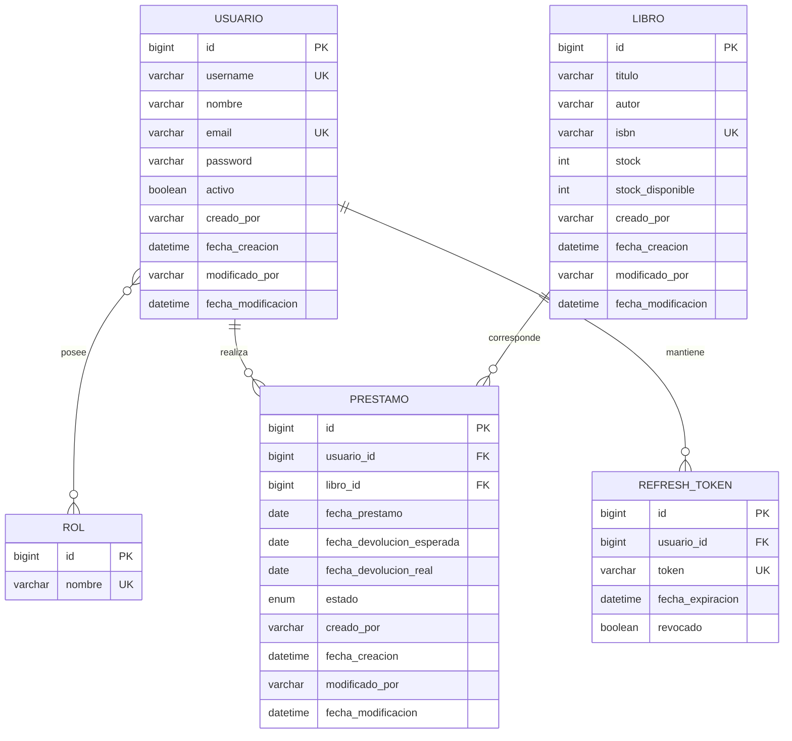

# Biblioteca Universitaria IDAT API

Backend REST desarrollado con Java 17 y Spring Boot para administrar usuarios, libros, préstamos y 
devoluciones de una biblioteca universitaria. La API utiliza MySQL, JPA/Hibernate y 
autenticación JWT sin sesión con roles `ADMIN` y `USER`.

## Funcionalidades

- Autenticación con access token y refresh token diferenciados.
- Rotación y revocación de refresh tokens.
- Administración de usuarios, roles y estado de cuentas.
- Catálogo de libros con búsquedas y control consistente de stock.
- Registro de préstamos y devoluciones.
- Historial limitado al usuario autenticado.
- Actualización de préstamos vencidos a `ATRASADO` al crear un préstamo o consultar el historial propio.
- Validación de solicitudes y manejo centralizado de errores.
- CORS configurable para clientes web locales.
- Auditoría automática de creación y modificación con el usuario autenticado.
- Documentación OpenAPI/Swagger.

## Arquitectura

```text
HTTP/JSON -> Controller -> Service -> Repository -> MySQL
                |            |
             DTO/Validación  Reglas de negocio
                |
       Spring Security + JWT
```

El código se organiza en `controller`, `service`, `repository`, `entity`, `dto`, `mapper`, `security`, `exception` y `config`.

### Estados y vencimiento de préstamos

Un préstamo se registra inicialmente con estado `ACTIVO`. Se considera vencido cuando su fecha de devolución esperada es anterior a la fecha actual y todavía no ha sido devuelto. En ese caso, la aplicación cambia su estado a `ATRASADO` al ejecutar alguna de estas operaciones:

- crear un nuevo préstamo;
- consultar el historial del usuario autenticado mediante `GET /api/prestamos/mios`.

Esta comprobación se realiza bajo demanda; actualmente no existe una tarea programada que se ejecute en segundo plano. Cuando se registra la devolución, el estado cambia a `DEVUELTO` y se incrementa el stock disponible del libro.

## Modelo de datos



### Auditoría

Las entidades `Usuario`, `Libro` y `Prestamo` incluyen automáticamente los campos `creadoPor`, `fechaCreacion`, `modificadoPor` y `fechaModificacion`. El cliente no debe enviarlos en las solicitudes: se presentan como información de solo lectura en los DTO de respuesta y en Swagger.

Spring Data JPA obtiene el nombre del usuario autenticado para registrar al responsable. Si una operación se ejecuta sin un usuario autenticado, por ejemplo durante una inicialización interna, se utiliza `SYSTEM`.

## Requisitos

- Java 17 o superior.
- MySQL 8 o superior.

## Configuración

1. Crear una base de datos vacía:

```sql
CREATE DATABASE biblioteca_idat_db CHARACTER SET utf8mb4 COLLATE utf8mb4_unicode_ci;
```

2. Crear la configuración privada local a partir de la plantilla:

```powershell
Copy-Item application-local.properties.example application-local.properties
```

Editar `application-local.properties` y completar la URL, el usuario y la contraseña de MySQL, además del secreto JWT. La aplicación carga automáticamente este archivo mediante `spring.config.import`.


### Configuración de CORS

CORS está habilitado para permitir el consumo de la API desde aplicaciones web. Los orígenes locales permitidos por defecto son:

- `http://localhost:4200`;
- `http://localhost:3000`;
- `http://localhost:5173`.

La configuración puede modificarse en `src/main/resources/application.properties` mediante las propiedades `app.cors.*`:

```properties
app.cors.allowed-origins=http://localhost:4200,http://localhost:3000,http://localhost:5173
app.cors.allowed-methods=GET,POST,PUT,PATCH,DELETE,OPTIONS
app.cors.allowed-headers=*
app.cors.exposed-headers=Location
app.cors.allow-credentials=true
app.cors.max-age=3600
```

Para conectar otro frontend, debe agregarse su origen exacto a `app.cors.allowed-origins`. En un despliegue real se deben registrar únicamente los dominios autorizados.

3. Iniciar la aplicación:

Hibernate crea o actualiza automáticamente las tablas mediante `spring.jpa.hibernate.ddl-auto=update`.

4. Después del primer inicio, ejecutar el script de datos iniciales:

```powershell
mysql -u root -p biblioteca_idat_db < database\01_roles_y_seed_data.sql
```

También puede abrirse el archivo `database/01_roles_y_seed_data.sql` en MySQL Workbench y ejecutarse sobre `biblioteca_idat_db`.

## Usuarios de demostración

El script SQL inicial crea estas cuentas exclusivamente para demostración local:

| Usuario | Contraseña | Rol |
|---|---|---|
| `admin` | `admin123` | `ADMIN` |
| `jperez` | `user123` | `USER` |

Las contraseñas deben cambiarse antes de desplegar la aplicación en un entorno real.

## Swagger

Con la aplicación iniciada:

- Interfaz: `http://localhost:8080/swagger-ui/index.html`
- Especificación JSON: `http://localhost:8080/v3/api-docs`

Para probar rutas protegidas, ejecutar `/api/auth/login`, copiar `accessToken`, pulsar **Authorize** e ingresar el token.

## Endpoints principales

| Método | Ruta | Acceso | Descripción |
|---|---|---|---|
| POST | `/api/auth/login` | Público | Iniciar sesión |
| POST | `/api/auth/refresh` | Público | Rotar y renovar tokens |
| POST | `/api/auth/logout` | Público | Revocar refresh token |
| GET | `/api/libros` | USER/ADMIN | Listar y filtrar libros |
| GET | `/api/libros/{id}` | USER/ADMIN | Consultar libro |
| POST | `/api/libros` | ADMIN | Registrar libro |
| PUT | `/api/libros/{id}` | ADMIN | Actualizar libro |
| DELETE | `/api/libros/{id}` | ADMIN | Eliminar libro sin historial |
| GET | `/api/usuarios` | ADMIN | Listar usuarios |
| GET | `/api/usuarios/{id}` | ADMIN | Consultar usuario |
| POST | `/api/usuarios` | ADMIN | Registrar usuario y roles |
| PATCH | `/api/usuarios/{id}/estado` | ADMIN | Activar/desactivar usuario |
| POST | `/api/prestamos` | ADMIN | Registrar préstamo |
| PATCH | `/api/prestamos/{id}/devolucion` | ADMIN | Registrar devolución |
| GET | `/api/prestamos/mios` | USER/ADMIN | Consultar historial propio |

### Ejemplo de login

```json
{
  "username": "admin",
  "password": "admin123"
}
```

### Ejemplo de registro de libro

```json
{
  "titulo": "Clean Code",
  "autor": "Robert C. Martin",
  "isbn": "9780132350884",
  "stock": 3
}
```

### Ejemplo de registro de usuario

```json
{
  "username": "lector.demo",
  "nombre": "Lector Demo",
  "email": "lector.demo@idat.edu.pe",
  "password": "Lector12345",
  "roles": ["USER"]
}
```

### Ejemplo de préstamo

```json
{
  "usuarioId": 2,
  "libroId": 1,
  "diasPlazo": 7
}
```

## Respuestas y errores

La API utiliza códigos HTTP coherentes:

- `200`: consulta o actualización correcta.
- `201`: recurso creado.
- `204`: operación correcta sin cuerpo.
- `400`: solicitud o validación inválida.
- `401`: credenciales o token inválido.
- `403`: usuario autenticado sin permisos.
- `404`: recurso no encontrado.
- `409`: duplicado o conflicto de estado.
- `422`: stock insuficiente.

Ejemplo de error:

```json
{
  "status": 400,
  "mensaje": "titulo: El título es obligatorio",
  "timestamp": "2026-08-09T17:00:00"
}
```


## Inicialización de base de datos

Hibernate administra la estructura de tablas automáticamente. El archivo `database/01_roles_y_seed_data.sql` incorpora los roles y usuarios de demostración y puede ejecutarse más de una vez sin duplicarlos.

## Repositorio y entrega

Repositorio GitHub: **pendiente de reemplazar con la URL pública o compartida con el docente**.

